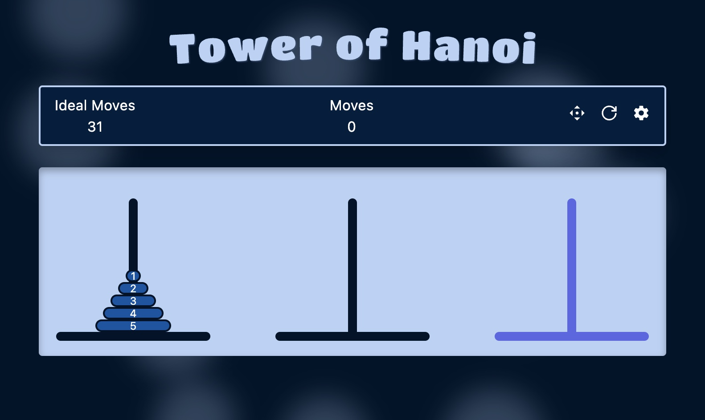

# Tower of Hanoi 🗼

Web implementation of the [Tower of Hanoi](https://en.wikipedia.org/wiki/Tower_of_Hanoi) puzzle made with React, Tailwind & Vite.

## Features

- Persistent data via Local Storage
- Offline support
- Star rating based on performance
- 9 different levels

## Motivation

I built this because I've always found this puzzle to be fun to solve but I did not find a web implementation with the features I was looking for, so I decided to build it myself and take the challenge as a learning opportunity.

The final result can be found [here](https://hanoi-tower-web.netlify.app)
